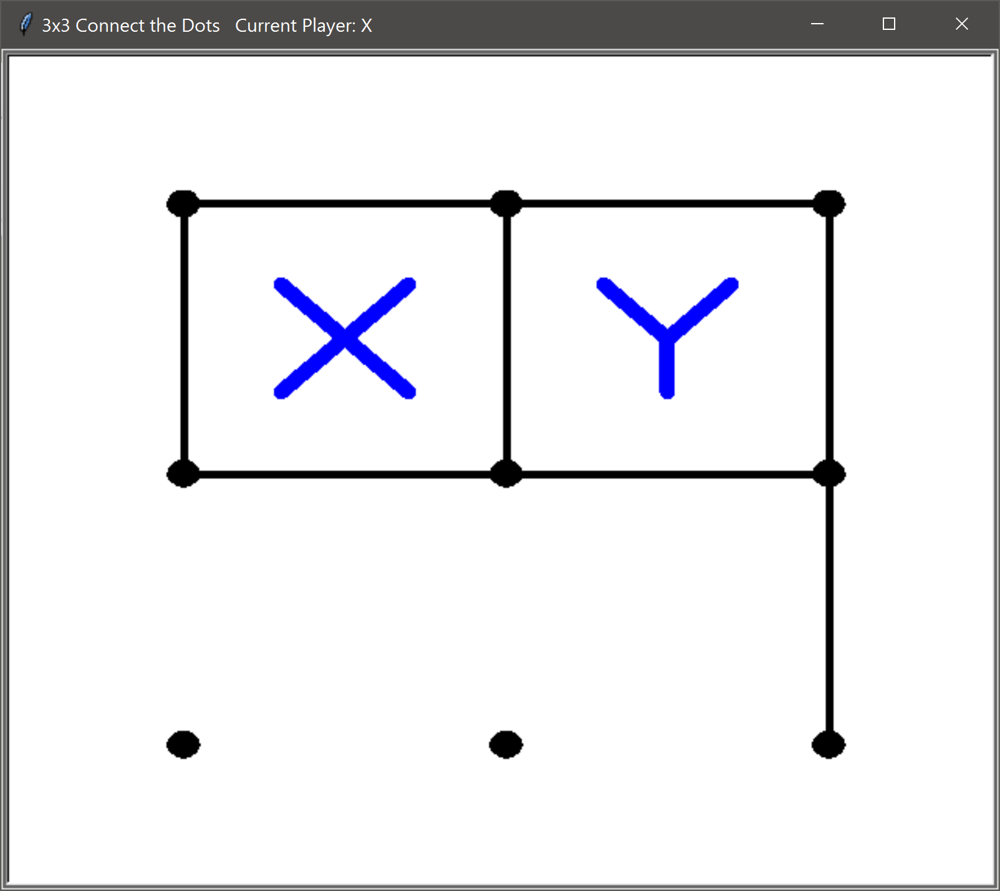

# Connect the dots (3x3)

A simplified version of of the connect the dots game

# Python3 Topics covered

Separating concerns with pluggable modules
 
Attribution
===========
“Fundamentals of Python Programming”, &copy;2016 Richard L. Halterman.
More Info:
    [url](http://python.cs.southern.edu/pythonbook.pdf)
